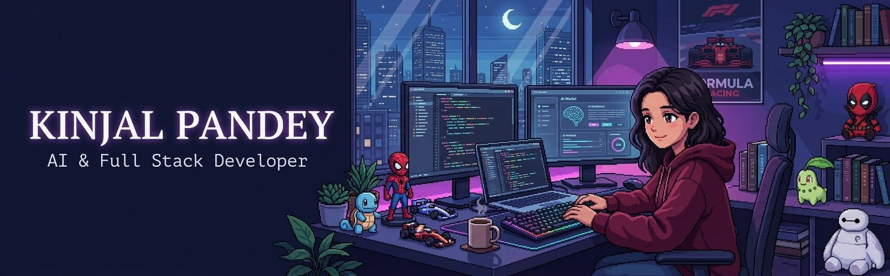
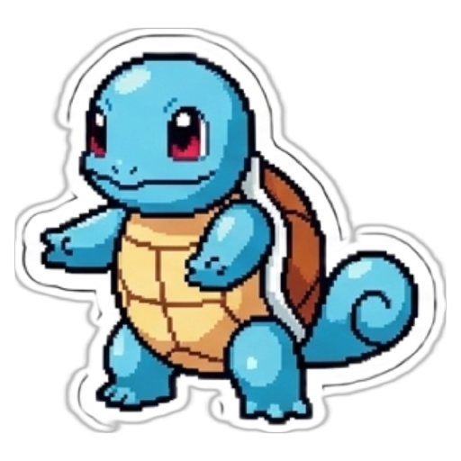
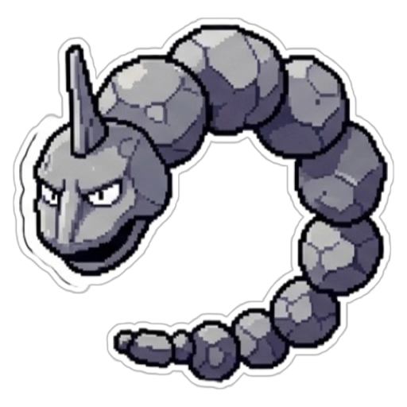
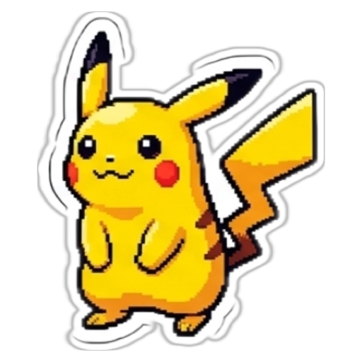

 

# KINJAL PANDEY

### AI Builder • Full Stack Developer • Realtime Systems Explorer

<h3>
Turning ideas into useful products with AI, clean code, thoughtful design and a little bit of pixel-art chaos.
</h3>

 

<h3>
🏎️ "Smooth operator under pressure."  
🏁 "Lights out and away we code."
</h3>

---

# 🌌 TRAINER PROFILE

<table align="center">
<tr>

<td width="58%" valign="top">

## 👩‍💻 ABOUT ME

<h4>

Computer Science student and builder.  

I enjoy transforming ideas into impactful products through AI, realtime systems and thoughtful design.

</h4>

### Currently Exploring

- LLMs & RAG
- AI agents
- Realtime applications
- Full stack systems
- IoT integrations

 

📍 India  
📧 [kindey2004@gmail.com](mailto:kindey2004@gmail.com)  
🔗 [LinkedIn](https://www.linkedin.com/in/kindey10/)  
🐦 [X / Twitter](https://x.com/Kindey_10)

</td>

<td width="42%" valign="top">

## 🎮 CURRENT QUEST

━━━━━━━━━━━━━━━━━━━━━━

> Exploring LLMs & RAG  
> Building realtime AI  
> Improving dev experience  
> Preparing for SWE roles  

 

Current Build : AI + Full Stack + DSA

 

</td>

</tr>
</table>

---

# ⚔️ TECH STACK

 

<table align="center">
<tr>

<td align="center">
 <b>C++</b>
</td>

<td align="center">
 <b>Python</b>
</td>

<td align="center">
 <b>JavaScript</b>
</td>

<td align="center">
 <b>TypeScript</b>
</td>

<td align="center">
 <b>React</b>
</td>

<td align="center">
 <b>Next.js</b>
</td>

<td align="center">
 <b>Django</b>
</td>

<td align="center">
 <b>Firebase</b>
</td>

<td align="center">
 <b>MongoDB</b>
</td>

<td align="center">
 <b>Git</b>
</td>

</tr>
</table>

---

# 🧩 FEATURED PROJECTS

 

<table align="center">

<tr>

<td width="33%" valign="top">

#  Vision-46

<h4>
Accessibility-focused ML web application designed for visually impaired users.
</h4>

`HTML` `CSS` `Python` `ML`

 

🕷️ Spidy Points : 480/500  
Made me win my 1st hackathon!

</td>

<td width="33%" valign="top">

#  Veritas

<h4>
AI-powered synthetic media detection browser extension.
</h4>

`JavaScript` `Python` `AI`

 

🕷️ Spidy Points : 495/500  
Best win ever! Worst sleepless nights ever!

</td>

<td width="33%" valign="top">

#  F1 Pitwall AI

<h4>
Realtime F1 telemetry and race analysis platform.
</h4>

`React` `FastAPI` `TypeScript`

 

🕷️ Spidy Points : 490/500  
Come-on its F1!!

</td>

</tr>

<tr>

<td width="33%" valign="top">

#  Smart IoT Door Lock

<h4>
RFID smart door lock with ESP8266 and Home Assistant integration.
</h4>

`C++` `ESP8266` `IoT`

 

🕷️ Spidy Points : 475/500  
1st internship 1st new skill

</td>

<td width="33%" valign="top">

#  Breathe ESG Review

<h4>
Workflow platform for ESG data ingestion and validation.
</h4>

`Django` `React` `PostgreSQL`

 

🕷️ Spidy Points : 485/500  
Worked for a dream!

</td>

<td width="33%" valign="top">

#  Sanskrit Setu

<h4>
Interactive Sanskrit learning platform powered by modern web tech.
</h4>

`Next.js` `Firebase` `Tailwind`

 

🕷️ Spidy Points : 470/500  
Soo many new things learned!

</td>

</tr>

</table>

---

# 🎯 CURRENT GOALS

 

<table align="center">
<tr>

<td width="50%" valign="top">

### 🕸️ Become a top-tier software engineer  
### 🕸️ Build impactful AI products  
### 🕸️ Master DSA & system design  

</td>

<td width="50%" valign="top">

### 🕷️ Contribute to meaningful open source  
### 🕷️ Work on realtime AI systems  
### 🕷️ Explore advanced ML & LLM apps  

</td>

</tr>
</table>

---

# 🌠 CONNECT WITH ME

 

  

<h2>
Every bug is a wild Pokémon battle. 
Let's catch them all and build something amazing.
</h2>

 

 

